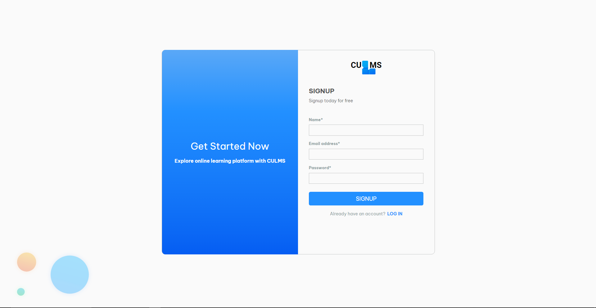
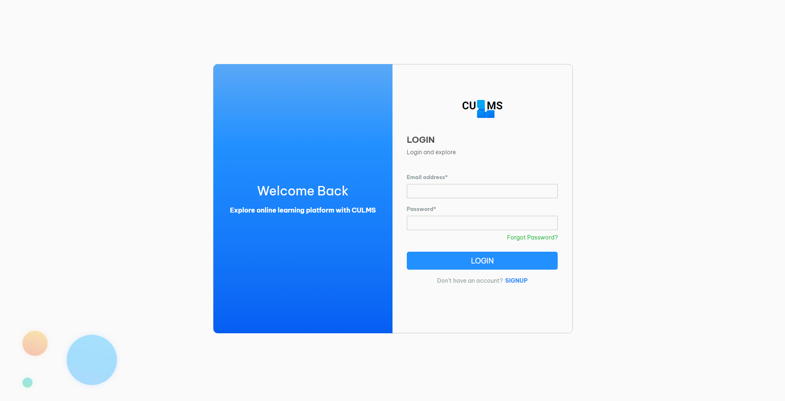
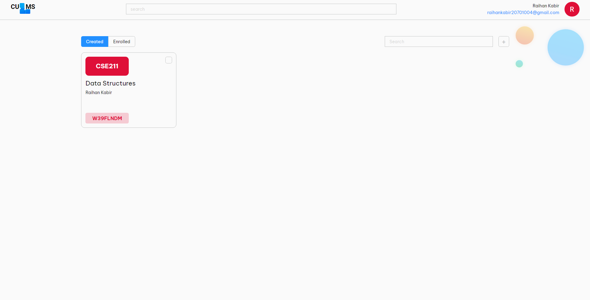
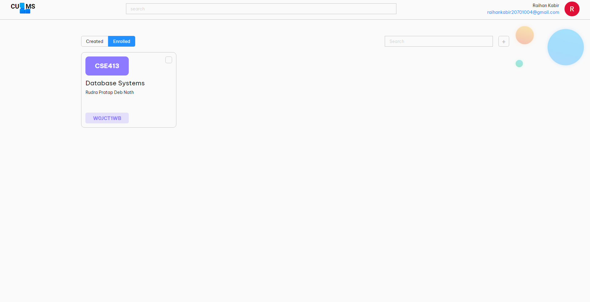
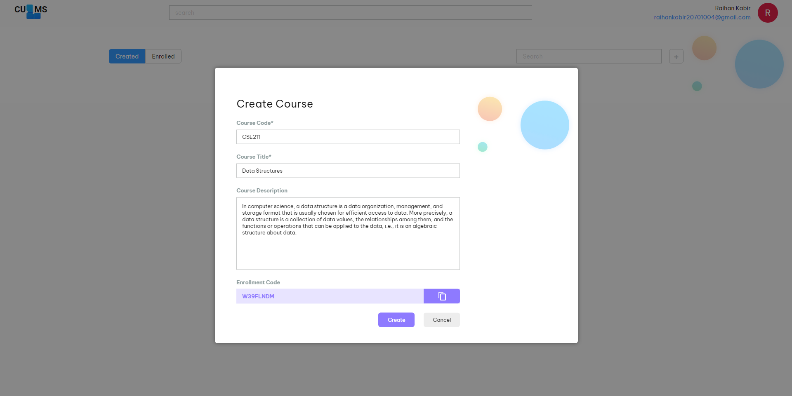
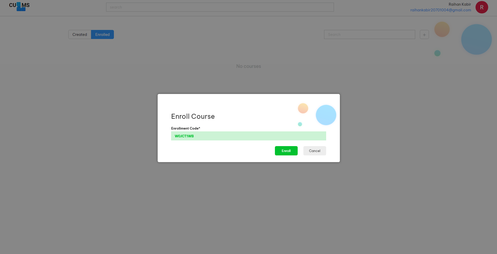
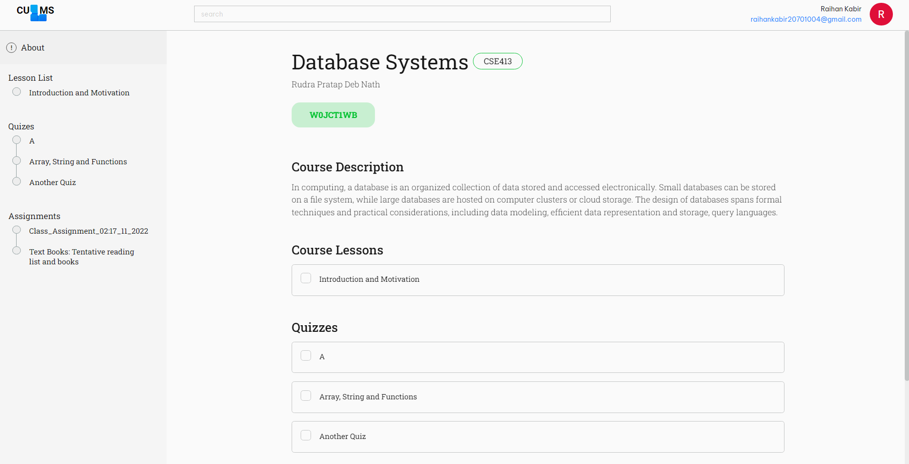

# CULMS - Learning Management System for University of Chittagong

CULMS is a computerized system used to enroll students in virtual courses,
host quizzes, assign assignments, and create lessons.

# Purpose of Project

The purpose of this project is to develop an application that handles data
using a database and applies the theories, methodologies, tools, and tech-
nologies that we learned in our database courses, CSE413 and CSE414.

# Background and Motivation

During the pandemic, teachers struggled to teach their courses to students
without a proper teaching environment. Students also wasted their time
because they lacked proper guidance. It was difficult for our teachers to
grade students’ work, take exams, and create new lesson plans on time. We
knew that we had to come up with a better way of managing this process
than what was currently being used. Since our teachers and students needed
structure and guidance that their current platform could not provide, we
created the software program CULMS to meet these needs.

# Installation Requirements

- Local Oracle Database Instance
- Oracle DBA user named `C##CULMS` and password `culms`
- Node >= `18.12.1`

# Installation

Follow the below steps to install CULMS on your local machine,

1. Clone the repository

```bash
$ git clone https://github.com/Raihan-28011/culms.git culms
```

2. Change your directory to `culms`

```bash
$ cd culms
```

3. Change your directory to `client` and install node packages

```bash
$ node install
```

4. After installation has been finished, change your directory to `server` and install node packages

```bash
$ cd ../server
$ npm install
```

5. After installation, to run the dev build type below commands,

```bash
$ npm run dev
$ cd ../client
$ npm run dev
```

6. Open your browser and type `localhost:5173` to start your local instance of `CULMS`.

# Getting Started

To get started using `CULMS`, below is a very basic tutorial,

## Signing up

As you open `CULMS` the first page is signup. It's fairly easy and we all are familiar with it.


## Login

If you already have an account just simply click on the `LOG IN` link in the signup page and it will take you to the the login page


## Dashboard

When you login, the first page you will encounter is the dashboard, where you will see the list of courses you have created yourself and also the list of courses that you are enrolled in.


You very easily create new courses, choosing the `created` tab and then clicking the `+` button on the right hand side corner of the dashboard,

You can also enroll to new courses by choosing the `enrolled` tab and clicking the `+` button, then providing the `enrollment code` you got from the course instructor,


## Course Page

By clicking on the course cards from the dashboard you can enter in to a course. When you enter into a course, you will first encounter all the information about the course, the lessons, quizzes and assignments created by you (if you have created the course) or the course instructor for that course.

On the side bar, you also have quicklinks to the lessons, quizzes and also the assignments. Rest of the website is very straight forward. Enjoy exploring all of it.

# Collaborators

1. [Raihan Kabir](https://github.com/Raihan-28011)
2. [Nazifa Binte Mahbub](https://github.com/Napomini)
3. [Tasnim Suraiya](https://github.com/deepty-56)
